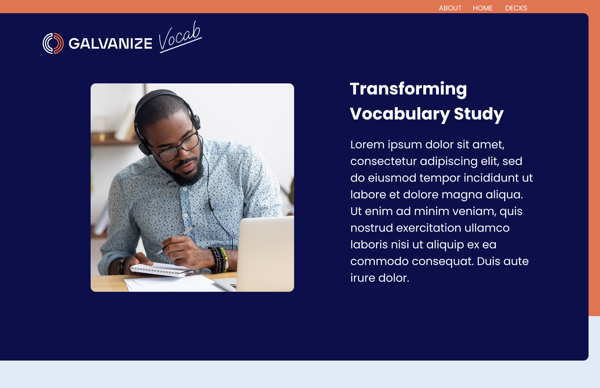
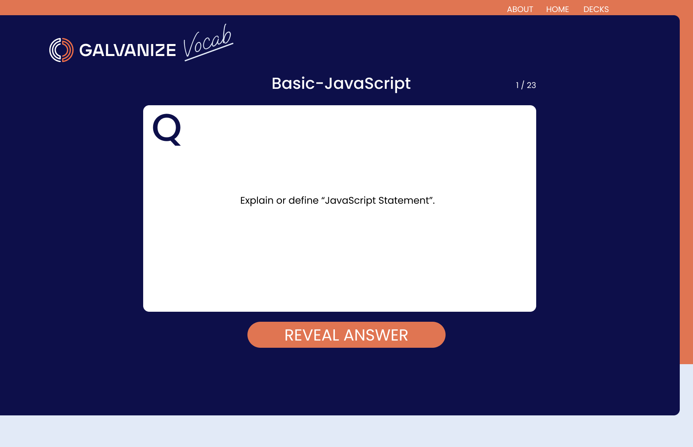
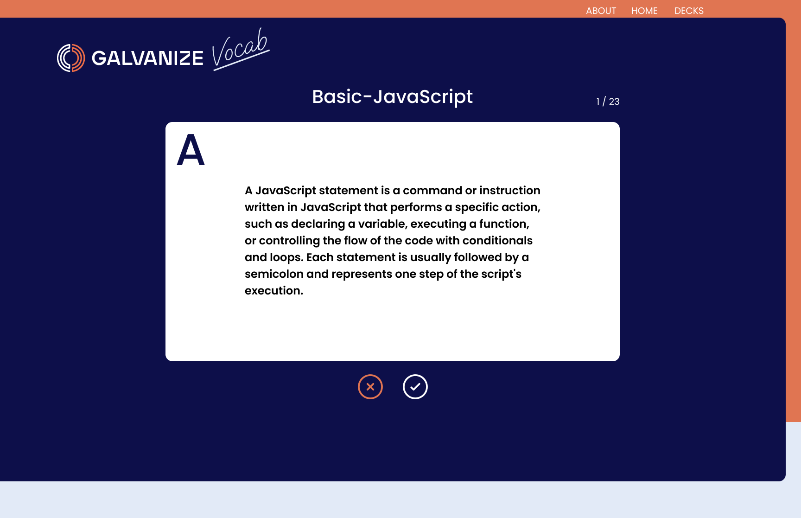
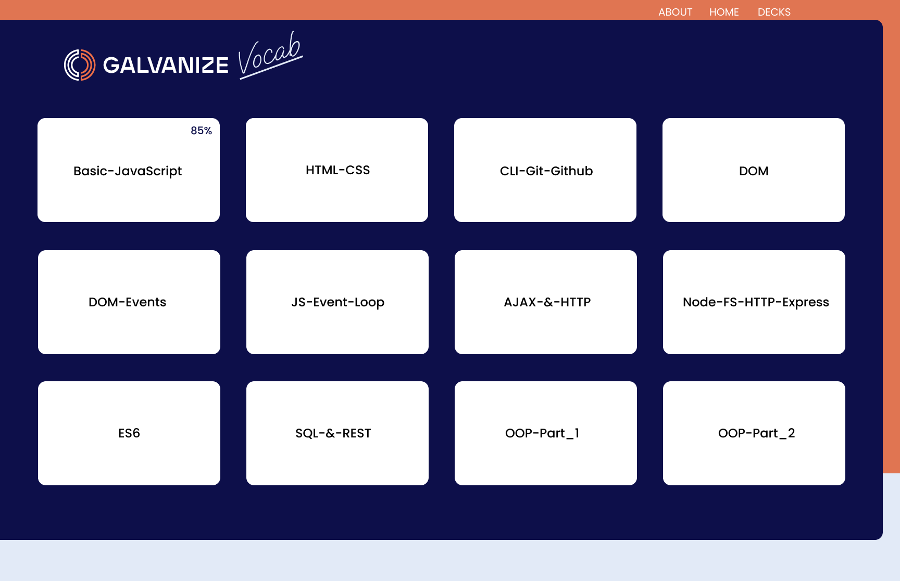
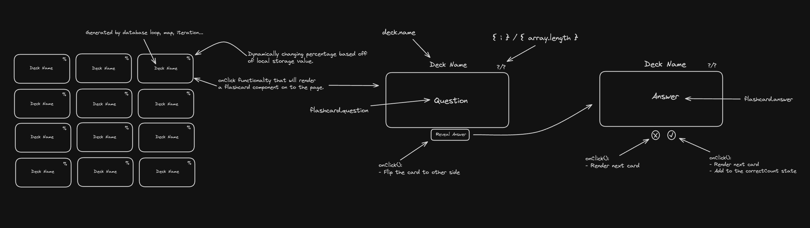

# MCSP-FEC Galvanize Vocab

[Link to Production](https://galvanizeflashcardsfrontend.onrender.com/)

# Tech used
This project is built using a range of modern web technologies:

- Frontend: JavaScript, HTML, CSS, React.js, Vite
- Backend: Node.js, Express.js
- Database: PostgreSQL

# Figma
[Link to figma prototypes](https://www.figma.com/file/Xt5caplEti9Oabgd0SoPR9/mcsp-fec?type=design&node-id=0%3A1&mode=design&t=2raNTk6dwRCgiTOA-1)

# Data Visualization

# Learning points
- React hooks
- CSS modules
- File architecture
- Local storage 

# For Developers

> **Note**: When you run `npm install` at the root, it will install all dependencies listed in `package.json`, `server/package.json`, and `client/package.json`.

## Development Setup

1. Install dependencies: `npm install`
1. Create your database: `createdb YOUR_DB`
1. Run your migrations: `psql -f server/migration.sql YOUR_DB`
1. Create your `.env` file: `cp .env.template .env`
1. Add your info in `.env`
1. Run the app: `npm run dev`

## Scripts

**Root**

- `npm run dev` - Runs the API server and hosts your frontend assets.
- `npm run dev:server` - Runs the API server in watch mode.
- `npm run dev:client` - Hosts your frontend assets.

**/client**

- `npm run dev` - Hosts your assets.
- `npm run build` - Builds your assets (mainly used in CI/CD).

**/server**

- `npm run dev` - Runs the server in watch mode.
- `npm run start` - Starts the server (mainly used when deploying).

